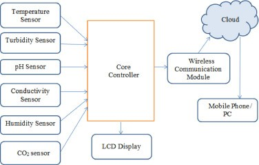
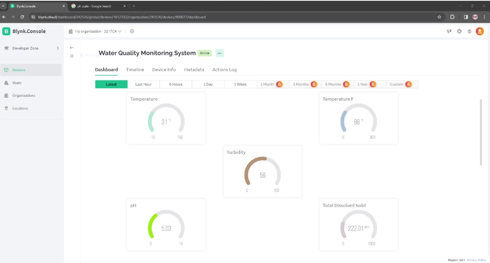
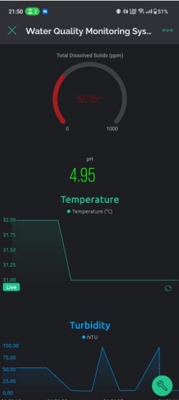

# 💧 Water Quality Monitoring using IoT

## 📌 Overview

This project implements a **Smart Water Quality Monitoring System** using IoT and Machine Learning to provide real-time insights into water quality. It addresses the key challenges of traditional water monitoring systems—namely their expense, time consumption, and lack of automation—by integrating low-cost sensors, microcontrollers, and data analytics tools.

The system measures multiple parameters such as pH, turbidity, temperature, TDS, CO₂, conductivity, and humidity using dedicated sensors. It then processes and transmits the data to the cloud via wireless modules. The processed data is analyzed using trained ML models to classify the water as potable or impure, with actionable insights provided for remediation.

---

## 🧰 Components Used

### 1. **Sensors**
- **pH Sensor:** Measures water acidity/alkalinity (Range: 0–14; Normal: 6–8.5)
- **TDS Sensor:** Detects total dissolved solids (higher TDS = less pure water)
- **Turbidity Sensor:** Measures water cloudiness (indicator of suspended particles)
- **Temperature Sensor (DS18B20):** Measures water temperature (Range: -55°C to +125°C)
- **Conductivity Sensor:** Measures water's electrical conductivity to assess ion levels
- **Humidity Sensor:** Monitors environmental moisture around the system
- **CO₂ Sensor:** Monitors the carbon dioxide concentration in the water environment

### 2. **Microcontroller**
- **ESP32** or **Arduino**
  - Reads sensor data
  - Processes readings
  - Transmits data using built-in **WiFi** or **Bluetooth**

### 3. **Communication Module**
- **Wireless Module:** Transmits data to a cloud server or central database

### 4. **LCD Display**
- Displays real-time sensor readings

### 5. **Cloud & Database**
- Centralized data storage and visualization
- Tools: Apache Hadoop, Apache Spark

---

## 📂 Project Structure

```bash
Water-Quality-Monitoring-using-IoT/
├── assets/
│   └── system_architecture.png
│
├── data/
│   └── water_quality_dataset.csv
│
├── models/
│   └── trained_model.pkl
│
├── src/
│   ├── sensor_readings.ino
│   ├── model_deployment.py
│   └── lcd_display.ino
│
├── analysis/
│   └── eda_and_training.ipynb
│
├── pattern/
│   ├── pattern.ino
│   └── name.ino
│
├── README.md
└── requirements.txt
```

---

## 🚀 How to Run This Project

### 1. Clone the repository

```bash
git clone https://github.com/yashdew03/Water-Quality-Monitoring-using-Iot.git
cd Water-Quality-Monitoring-using-Iot
```

### 2. Set up your environment
```bash
python -m venv venv
source venv/bin/activate       # Windows: venv\Scripts\activate
pip install -r requirements.txt
```

### 3. Run the files


---


## 🧠 Machine Learning Integration

### 📈 Model Training:
- Trained using real-time and historical water quality datasets
- Algorithms Used:
  - `Decision Trees`
  - `Random Forest`
  - `Support Vector Machines (SVM)`

### 🧪 Use of ML:
- Classifies water as **potable** or **impure**
- Provides suggestions to improve water quality
- Identifies potential use cases for impure water

---

## 🔁 Workflow

1. **Sensor Initialization** – Setup and calibration of sensors
2. **Data Acquisition** – Real-time data captured from water
3. **Data Transmission** – Wireless data upload to cloud
4. **Data Storage** – Centralized logging in database
5. **Model Deployment** – Predict water quality using trained ML models
6. **Alerts & Suggestions** – Provide alerts and improvement strategies
7. **Visualization** – Real-time display on LCD and dashboard

---

## 🌐 System Architecture

 

---

## 🧪 Sample Output

Real-time values and classification result are displayed on a 16×2 LCD display and wirelessly sent to the cloud. A machine learning model classifies the water and suggests purification methods or usage recommendations.

---

## 📊 Data Analysis Tools

- **Python** (`Pandas`, `NumPy`, `scikit-learn`)
- **R**
- **MATLAB**

These tools are used for:
- Visualization
- Exploratory Data Analysis (EDA)
- Model training and evaluation

---

## 🔧 Requirements

### Hardware:
- `pH Sensor`
- `Turbidity Sensor`
- `TDS Sensor`
- `DS18B20 Temperature Sensor`
- `ESP32`/`Arduino`
- `CO₂ Sensor`
- `Conductivity Sensor`
- `Humidity Sensor`
- `16x2 LCD Display`
- `OLED Display`
- `WiFi module` (if using Arduino)

### Software:
- Arduino IDE / ESP32 SDK
- Python 3.x
- Jupyter Notebook / Google Colab
- ML libraries (scikit-learn, matplotlib, seaborn)
- Apache Hadoop or Spark (optional for big data)

---

## 📌 Future Enhancements

- Add GPS module for location-specific data
- Integration with mobile apps for notifications
- Automatic chemical dosing system based on feedback
- Enhanced anomaly detection using deep learning models

---

## 🚀 Dashboard






 

---

## 👨‍🔬 Contributing
Contributions are welcome! Please open an issue or submit a PR for enhancements or fixes. Feel free to check the [issues page](https://github.com/yashdew3/Water-Quality-Monitoring-using-Iot/issues) (if you have one) or open a new issue to discuss changes. Pull requests are also appreciated.

---

## 📜 License
This project is licensed under the MIT License.

## ## 📬 Contact
- Built by **Yash Dewangan**
- Github: [YashDewangan](https://github.com/yashdew3)
- Email: [yashdew06@gmail.com](mailto:yashdew06@gmail.com)
- Linkedin: [YashDewangan](https://www.linkedin.com/in/yash-dewangan)

Enjoy using the Water Quality Monitoring using Iot in any type of Water! 🚀